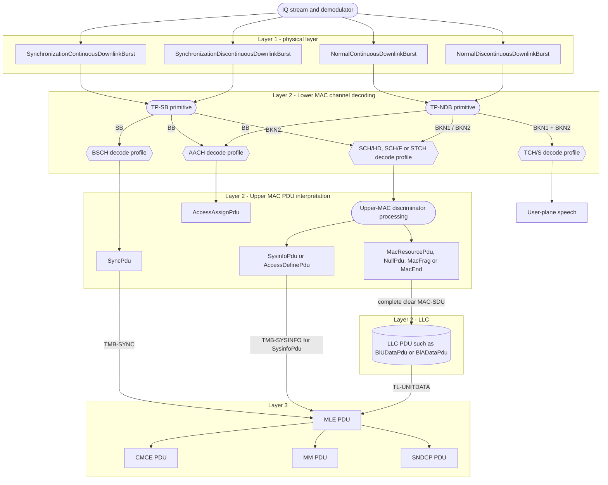

# TETRA downlink layer flow

Normative baseline: ETSI EN 300 392-2 V3.8.1 (2016-08).

The complete downlink split is shown in one diagram below.

## Responsibilities

| Stage | Main responsibility | Example output |
| --- | --- | --- |
| PHY | Burst recognition, training and stealing indication | `SynchronizationContinuousDownlinkBurst` |
| Lower MAC | Descrambling, deinterleaving, channel decoding and CRC | Decoded BSCH, AACH, SCH or TCH block |
| Upper MAC | MAC PDU parsing, addressing, resources and fragmentation | `SyncPdu`, `SysinfoPdu`, `MacResourcePdu` |
| LLC | Logical-link framing and acknowledged/unacknowledged delivery | `BlUDataPdu`, `AlDataPdu` |
| MLE | Mobile-link control and Layer-3 protocol dispatch | `DMleSync`, `DMleSysinfo`, `DNwrkBroadcast` |
| CMCE | Call control and short-data signalling | `DSetup`, `DConnect`, `DSdsData` |
| MM | Mobility, authentication and location management | `DAuthentication`, `DLocationUpdateAccept` |
| SNDCP | Packet-data convergence | Network-layer packet delivery |

## Layer 1 to Layer 2 split

Layer 1 recognizes four downlink burst types:

1. `SynchronizationContinuousDownlinkBurst` (510 bits)
2. `NormalContinuousDownlinkBurst` (510 bits)
3. `SynchronizationDiscontinuousDownlinkBurst` (492 bits)
4. `NormalDiscontinuousDownlinkBurst` (492 bits)

The continuous and discontinuous forms have different edge/phase layouts, but
the same synchronization or normal burst family delivers the same logical
block categories to Lower MAC.



### Diagram shape legend

| Shape | Meaning |
| --- | --- |
| Rectangle | A real burst or protocol PDU |
| Rounded rectangle | A processing layer, SAP primitive, or internal operation |
| Hexagon | A logical channel and its Lower-MAC decode profile; not a PDU |
| Cylinder | Encapsulated SDU/PDU data passed to another sublayer |

The boxes make the boundary explicit:

- `BSCH`, `AACH`, `SCH/HD`, `SCH/F`, `STCH`, and `TCH/S` are logical
  channel/decoder paths handled by Lower MAC. They are not Upper-MAC PDU types.
- `SyncPdu`, `AccessAssignPdu`, `SysinfoPdu`, `AccessDefinePdu`,
  `MacResourcePdu`, `NullPdu`, `MacFrag`, and `MacEnd` are Upper-MAC PDU types.
- LLC is another Layer-2 sublayer above MAC, not an Upper-MAC PDU type. Only a
  complete clear MAC-SDU from the data path can carry an LLC PDU.
- `SyncPdu` and the MLE payload of `SysinfoPdu` use the MAC broadcast service
  path directly to MLE; they do not pass through LLC.
- `TCH/S` carries user-plane traffic and bypasses Upper-MAC PDU and LLC parsing.

### Exact PHY to Lower-MAC mapping

| Layer-1 burst | Physical blocks passed to Lower MAC | Lower-MAC decoding paths |
| --- | --- | --- |
| `SynchronizationContinuousDownlinkBurst` | `SB`, `BB`, `BKN2` | `BSCH`, `AACH`, `SCH/HD` |
| `SynchronizationDiscontinuousDownlinkBurst` | `SB`, `BB`, `BKN2` | `BSCH`, `AACH`, `SCH/HD` |
| `NormalContinuousDownlinkBurst` | `BB`, `BKN1`, `BKN2` | `AACH`, then `SCH/F`, two `SCH/HD`, `STCH`, or `TCH/S` |
| `NormalDiscontinuousDownlinkBurst` | `BB`, `BKN1`, `BKN2` | `AACH`, then `SCH/F`, two `SCH/HD`, `STCH`, or `TCH/S` |

For a normal burst, AACH supplies the downlink usage marker. Together with the
stealing flag it determines how `BKN1` and `BKN2` are decoded:

| Usage | Stealing flag | Lower-MAC interpretation |
| --- | ---: | --- |
| Common control (`UMa`/`UMc`) | `0` | `BKN1+BKN2` form one `SCH/F` block |
| Common control (`UMa`/`UMc`) | `1` | `BKN1` and `BKN2` form two separate `SCH/HD` blocks |
| Traffic (`Umt`) | `0` | `BKN1+BKN2` form `TCH/S normal` |
| Traffic (`Umt`) | `1` | `BKN1` is `STCH`; `BKN2` is `STCH` or `TCH/S stealing` |

### Lower MAC to Upper MAC mapping

| Lower-MAC channel/result | Direct Upper-MAC interpretation | Synchronization PHY | Normal PHY |
| --- | --- | :---: | :---: |
| `BSCH` | `SyncPdu` | Yes | No |
| `AACH` | `AccessAssignPdu` | Yes | Yes |
| `SCH/HD` | MAC signalling PDU | Yes | Yes |
| `SCH/F` | MAC signalling PDU | No | Yes |
| `STCH` | Stolen MAC signalling PDU | No | Yes |
| `TCH/S normal` | Speech frames; bypasses Upper-MAC PDU parsing | No | Yes |
| `TCH/S stealing` | Speech frame; bypasses Upper-MAC PDU parsing | No | Yes |

Here “Synchronization PHY” means either synchronization burst variant, and
“Normal PHY” means either normal burst variant.

### Upper-MAC signalling PDU split

An `SCH/HD`, `SCH/F`, or `STCH` signalling block can decode to the following
Upper-MAC family. The exact PDU still depends on its MAC discriminator, subtype,
length, channel context, and a successful channel CRC.

| Upper-MAC type | Synchronization continuous | Synchronization discontinuous | Normal continuous | Normal discontinuous |
| --- | :---: | :---: | :---: | :---: |
| `SyncPdu` | Yes, via `SB/BSCH` | Yes, via `SB/BSCH` | No | No |
| `AccessAssignPdu` | Yes, via `BB/AACH` | Yes, via `BB/AACH` | Yes, via `BB/AACH` | Yes, via `BB/AACH` |
| `SysinfoPdu` | Yes, via `BKN2/SCH-HD` | Yes, via `BKN2/SCH-HD` | Yes, via signalling | Yes, via signalling |
| `AccessDefinePdu` | Yes, via `BKN2/SCH-HD` | Yes, via `BKN2/SCH-HD` | Yes, via signalling | Yes, via signalling |
| `MacResourcePdu` / `NullPdu` | Possible via `BKN2/SCH-HD` | Possible via `BKN2/SCH-HD` | Yes, via signalling | Yes, via signalling |
| `MacFrag` / `MacEnd` | Possible via `BKN2/SCH-HD` | Possible via `BKN2/SCH-HD` | Yes, via signalling | Yes, via signalling |
| Speech/traffic | No | No | Yes, via `TCH/S` | Yes, via `TCH/S` |

“Possible” does not mean that every synchronization burst may contain that
PDU. It means the synchronization burst has an `SCH/HD` transport opportunity
whose valid MAC discriminator may select that type. Addressing, allocation,
fragment state, encryption, and CRC validity impose additional constraints.

LLC is never a direct Layer-1 payload type. It can only follow a complete,
clear MAC-SDU:

```text
PHY burst → physical block → Lower-MAC channel decode → Upper-MAC PDU
          → complete clear MAC-SDU → LLC PDU → MLE or another Layer-3 user
```

The Layer-1 log never prints the contents of coded MAC blocks. Their decoded
meaning belongs in the separate Layer-2 processing path.
